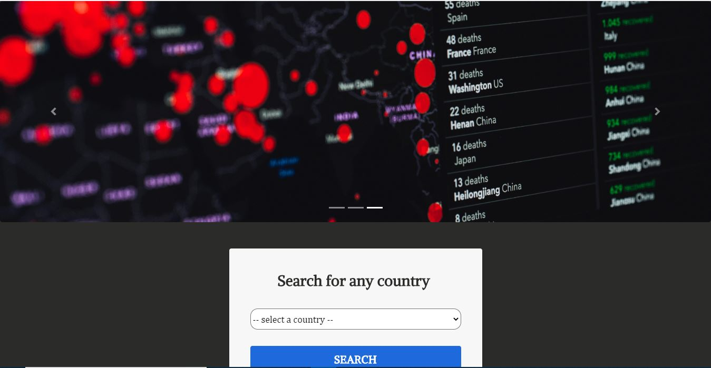
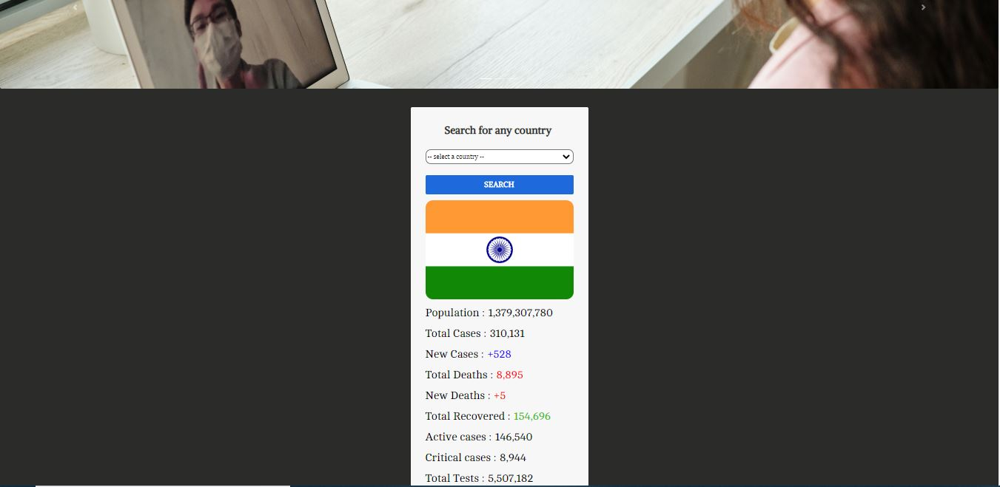
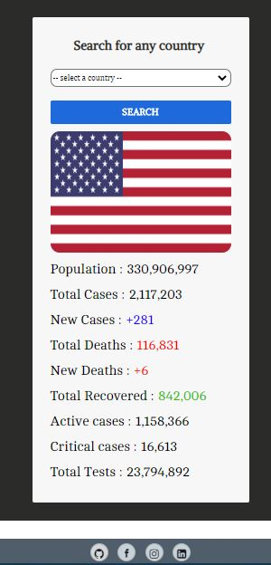

# Covidometer
This app will let you the recent statistics about COVID-19 of any country you want to view
This is a simple Django appliaction which uses web scrapping to collect all the updated statistics related to Corona 
i.e Total cases, new cases , Total deaths , new deaths ,Total tests etc..of whichever country the user selects in...

This app uses BeautifulSoup module to do web scrapping.

